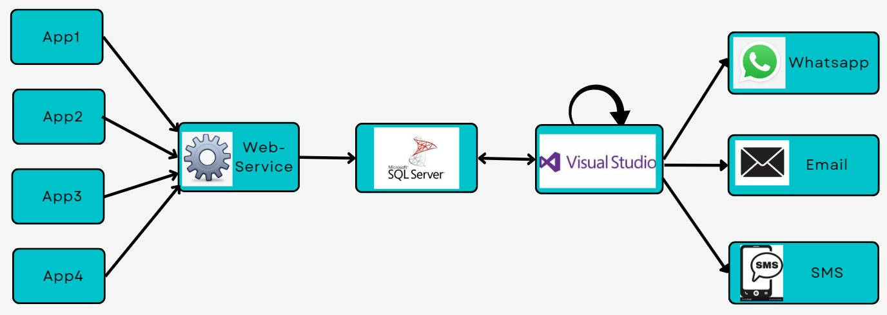
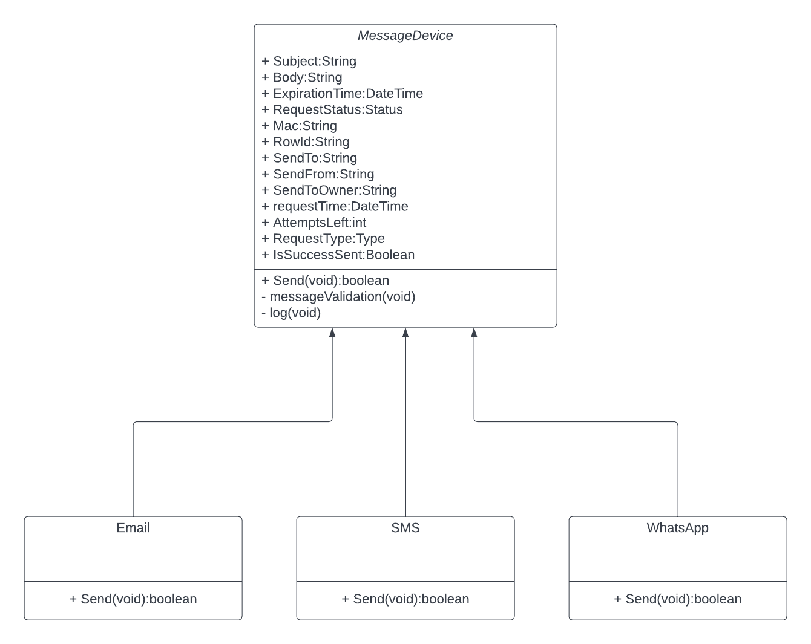
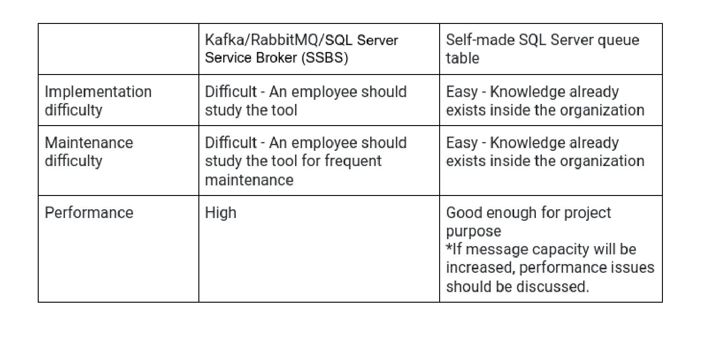

# Message Queue
A message queue for sending text messages using WhatsApp, Email, and SMS. This is a project that I've built from scratch for Primor factory. In the factory, each machine sends messages at specific times. For example, when the process is finished, or when a problem has occurred. Until this project, a message was sent through SMS or Email. During the development, the WhatsApp message option was added by me.
The problem before: message sending can fail, and it is difficult to track these failures.
The solution I built: develop a message queue for storing all messages and send them in synchronic order. The queue will track down the failed messages and handle them as required.

## Project Architecture

## Technology selection

The project is written in SQL Server as the database and C# as the backend language. database: My options were a built-in tool (RabbitMQ, Kafka, SQL Server Service Broker) And a simple self-made table in SQL Server. The key principles for this decision were:

1. Simplicity - the system should be simple, due to a lack of maintenance resources
2. Speed of message delivering - less important. message can be delivered even after a minute and more. If message capacity will be increased, performance issues should be discussed.
3. Capacity of messages - a couple of dozens per day After taking into consideration these key principles, it was decided to go with a simple self-made table in SQL Server.
The main disadvantage is that this option is missing multithreaded operating, which leads to a lack of performance.
In this given capacity and speed, it was decided to stay with a simple self-made table in SQL Server.

## Code Design

The project is written in SQL Server as the database and C# as the backend language. database: My options were a built-in tool (RabbitMQ, Kafka, SQL Server Service Broker) And a simple self-made table in SQL Server.  

The key principles for this decision were:
1. Simplicity - the system should be simple, due to a lack of maintenance resources
2. Speed of message delivering - less important. message can be delivered even after a minute and more. If message capacity will be increased, performance issues should be discussed.
3. The capacity of messages - a couple of dozens per day
  

   
After taking into consideration these key principles, it was decided to go with a simple self-made table in SQL Server.
The main disadvantage is that this option is missing multithreaded operating, which leads to a lack of performance.  
In the given capacity and speed, it was decided to stay with a simple self-made table in SQL Server.

# Programming language

My main idea was to build a scalable program. This can be achieved by using an Object Oriented language. The company works in a .NET environment, so it was natural to go with the C# language.
Unsolved problem: Message can be delivered and the program can crash just before table update. This will lead to duplication of message sending.
Problems\Extensions that can be in the future

1. Another messaging method can be implemented
Solusion - The project was created following the Abstraction OOP concept, which allows simple implementation of another messaging method (using a class inherit from an abstract class).

2. Messaging capacity can increase
Solusion - The general direction of the company is to move from Emails and SMS messages to WhatsApp. In the future, increasing capacity will affect the WhatsApp API, and should be handled in this scope. For example, use more SIM cards, and send messages from multiple SIM cards.
